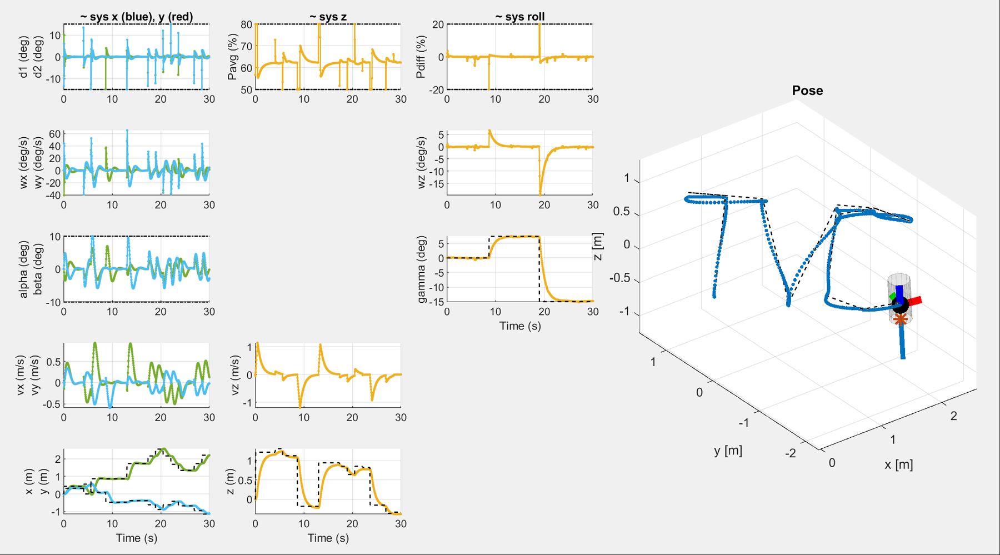
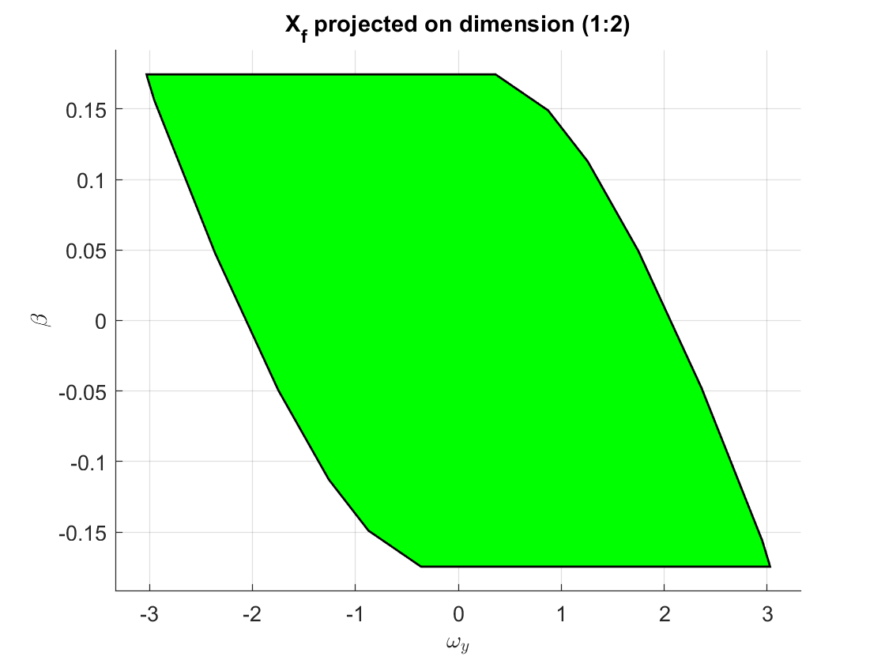
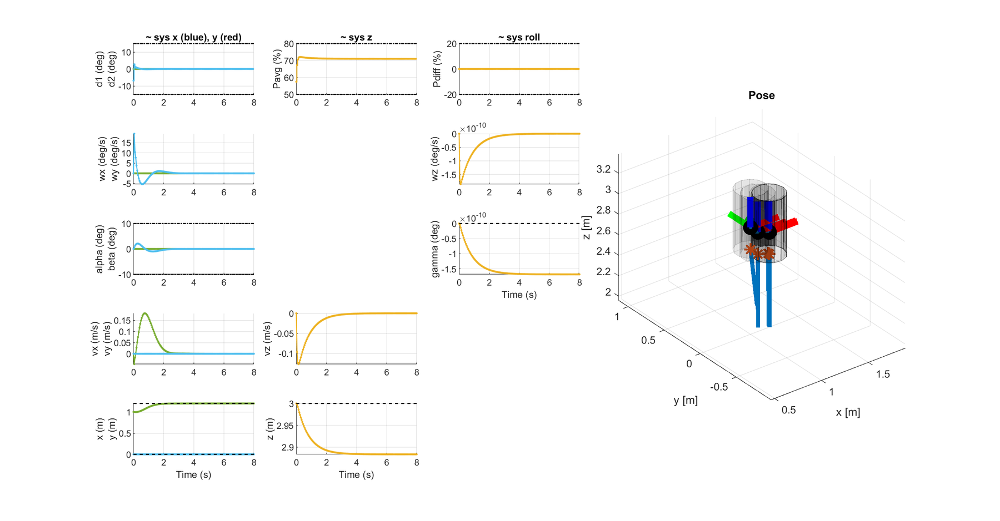
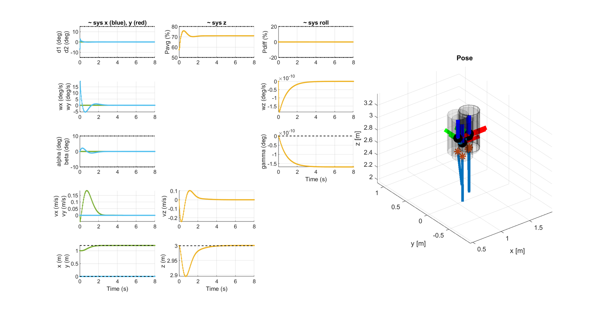
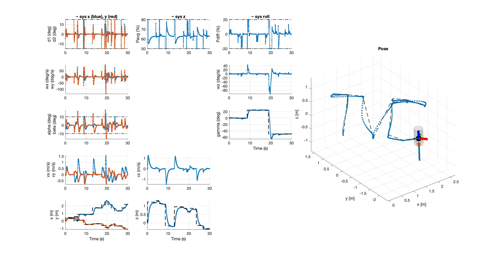
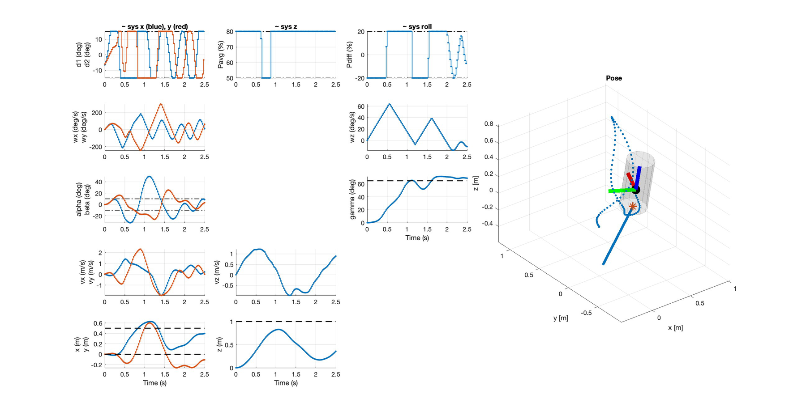
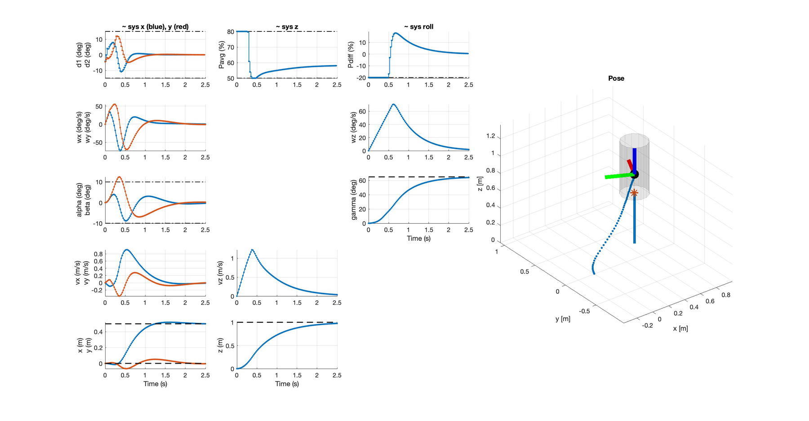

# Rocket Thrust-Vector Control with Model Predictive Control

**EPFL · ME-425 Model Predictive Control · Mini-Project (Group AW) · January 2024**

MATLAB implementation of a full MPC stack for a thrust-vector-controlled (TVC) rocket: from
linearisation and sub-system decomposition, through constrained linear MPC with terminal
invariant sets, offset-free tracking under model mismatch, and finally to a nonlinear MPC (NMPC)
with input-delay compensation.

📄 **[Full technical report (PDF)](report/MPC_mini_project_report.pdf)**: derivations, tuning
rationale, terminal-set plots and closed-loop results.



*Deliverable 4.1: the four sub-system controllers merged and run against the **nonlinear**
plant, tracing the letters "TVC" in 3-D over 30 s. Dashed lines are the reference; the input
panels show δ₁/δ₂, P<sub>avg</sub> and P<sub>diff</sub> riding their constraints (dash-dot).*

---

## The system

The rocket is actuated by two counter-rotating racing propellers mounted on a gimbal, tilted by
two servos. It is a **12-state, 4-input** nonlinear system:

| | Symbol | Description |
|---|---|---|
| **States** (12) | ω = (ω<sub>x</sub>, ω<sub>y</sub>, ω<sub>z</sub>) | angular velocity (body frame) |
| | φ = (α, β, γ) | Euler angles (roll γ about the body axis) |
| | v = (v<sub>x</sub>, v<sub>y</sub>, v<sub>z</sub>) | linear velocity (world frame) |
| | p = (x, y, z) | position (world frame) |
| **Inputs** (4) | δ₁, δ₂ | servo deflection angles |
| | P<sub>avg</sub> | average throttle |
| | P<sub>diff</sub> | throttle difference |

**Trim point.** At hover the only force to cancel is gravity, which requires
`P_avg = 56.67 %` with all other inputs at zero. Linearising about this trim point yields an `A`
matrix with no cross-coupling between the groups below, so the system splits into **four
independent sub-systems**; this decomposition is what makes the linear part of the project
tractable:

| Sub-system | States | Input | Constraints |
|---|---|---|---|
| **x** | ω<sub>y</sub>, β, v<sub>x</sub>, x | δ₂ | \|β\| ≤ 0.1745 rad, \|δ₂\| ≤ 0.26 rad |
| **y** | ω<sub>x</sub>, α, v<sub>y</sub>, y | δ₁ | \|α\| ≤ 0.1745 rad, \|δ₁\| ≤ 0.26 rad |
| **z** | v<sub>z</sub>, z | P<sub>avg</sub> | 50 % ≤ P<sub>avg</sub> ≤ 80 % |
| **roll** | ω<sub>z</sub>, γ | P<sub>diff</sub> | \|P<sub>diff</sub>\| ≤ 20 % |

Note that the z-constraints are **asymmetric** once shifted by the trim input:
`−6.67 % ≤ ΔP_avg ≤ 23.33 %`.

---

## Repository layout

```
rocket_project/
├── Deliverable_3_1/     Regulation MPC per sub-system (terminal set + terminal cost)
├── Deliverable_3_2/     Reference tracking via steady-state target computation
├── Deliverable_4_1/     Four controllers merged, run on the NONLINEAR rocket
├── Deliverable_5_1/     Offset-free tracking, constant mass disturbance
├── Deliverable_5_2/     Offset-free tracking, time-varying mass
├── Deliverable_6_1/     Nonlinear MPC (CasADi + IPOPT), full 12-state model
├── Deliverable_6_2/     NMPC with input-delay compensation
├── src/
│   ├── @Rocket/         Rocket class: dynamics, trim, linearize, decompose, simulate, plots
│   ├── MpcControlBase.m Abstract base class, builds the YALMIP optimizer, exposes get_u()
│   ├── estimator_z.m    Wraps the z-observer into a full-state estimation function
│   └── ref_TVC.m        Reference generator: traces the letters "TVC" in 3-D
├── templates/           Unmodified course skeletons (for reference/diffing)
└── sciper.txt           Group members
report/
├── MPC_mini_project_report.pdf
└── figures/             Figures used by this README, extracted from the report
```

Each `Deliverable_X_Y/` folder is **self-contained**: it holds its own copy of the controller
classes at the state they had for that deliverable, so every deliverable can be reproduced
independently without checking out an earlier revision. The controllers therefore evolve across
folders; e.g. `MpcControl_z.m` gains a steady-state target in `3_2` and a disturbance observer
in `5_1`.

---

## Requirements

| Dependency | Used for |
|---|---|
| MATLAB (R2021b+) | n/a |
| Control System Toolbox | `c2d`, `dlqr`, `place`, `ssdata` |
| [YALMIP](https://yalmip.github.io/) | modelling the linear MPC problems (`optimizer` objects) |
| [Gurobi](https://www.gurobi.com/) | QP solver (free academic licence) |
| [MPT3](https://www.mpt3.org/) | `polytope`, maximal invariant set computation |
| [CasADi](https://web.casadi.org/) | NMPC (Deliverables 6.1 / 6.2), solved with IPOPT |

> Gurobi is hard-coded via `sdpsettings('solver','gurobi')`. To use another QP solver
> (e.g. `quadprog`, `mosek`), change that one line in each `MpcControl_*.m`.

## Running

Each deliverable is a standalone script that produces all of its own figures. From MATLAB:

```matlab
cd rocket_project/Deliverable_3_1
Deliverable_3_1
```

The scripts add `../src` to the path themselves. Deliverables 6.1 and 6.2 additionally require
CasADi to be on the MATLAB path.

---

## What each deliverable does

### 3.1 Regulation MPC per sub-system

Each sub-system gets a constrained finite-horizon regulator

$$J^*(x)=\min_{x,u}\ \sum_{i=0}^{N-1} \big(x_i^\top Q x_i + u_i^\top R u_i\big) + x_N^\top Q_f x_N$$

subject to the dynamics, `Fx ≤ f`, `Mu ≤ m` and the terminal constraint `x_N ∈ X_f`.

**Recursive feasibility** is guaranteed by the standard terminal ingredients: `K` comes from an
unconstrained LQR, `Q_f` is the corresponding Riccati solution returned by `dlqr`, and `X_f` is
computed as the **maximal invariant set** of the closed loop `x⁺ = (A + BK)x` by iterating
`X_f ← X_f ∩ pre(X_f)` until convergence. Each controller plots its own terminal set (projected
onto 2-D slices for the 4-state sub-systems).

<p align="center">
  
</p>

*The x sub-system's terminal set projected onto (ω<sub>y</sub>, β). The flat top and bottom at
β = ±0.1745 are the state constraint; the sheared sides come from the input constraint
\|δ₂\| ≤ 0.26 propagated backwards through the LQR closed loop.*

Tuning: `H = 10 s`, `T_s = 1/20 s`, `R = 1` throughout:

```
Q_x = Q_y = diag(10, 10, 10, 30)    Q_z = diag(50, 50)    Q_roll = diag(20, 20)
```

The horizon is the main feasibility/computation-time trade-off; 10 s was the shortest horizon
that kept the problem feasible from the required initial conditions.

### 3.2 Reference tracking

Adds `setup_steady_state_target()`: given a position reference, solve for a feasible steady-state
pair `(x_s, u_s)` satisfying `x_s = A x_s + B u_s`, `C x_s = ref`, `M u_s ≤ m`, minimising `u_s²`.
The regulator then penalises deviations from that target instead of from the origin.

### 4.1 Merged controllers on the nonlinear plant

The four linear controllers are merged with `rocket.merge_lin_controllers(...)` and run in closed
loop against the **nonlinear** simulator, tracking a path that traces the letters **"TVC"** in
3-D over 30 s (`ref_TVC.m`, tilted by an arbitrary rotation so all axes are exercised).

### 5.1 / 5.2 Offset-free tracking

The rocket's true mass (2.13 kg) differs from the modelled one, producing a steady-state altitude
error the nominal z-controller cannot remove. The fix is a disturbance observer on an augmented
model:

$$\bar A=\begin{bmatrix}A & B\\ 0 & I\end{bmatrix},\qquad
\bar B=\begin{bmatrix}B\\ 0\end{bmatrix},\qquad
\bar C=\begin{bmatrix}C & 0\end{bmatrix}$$

with `L` placed at poles `[0.5, 0.6, 0.7]` (inside the unit circle ⇒ stable error dynamics). The
estimated disturbance `d_est` is then fed into the steady-state target computation, giving
offset-free tracking.

- **5.1**: constant disturbance (`rocket.mass = 2.13`). The offset is fully rejected.
- **5.2**: *time-varying* mass (`mass_rate = -0.27`, fuel burn). The observer was designed for a
  constant `d`, so a residual drift remains; the report discusses this and points at an adaptive
  estimator as the fix.

| Without the observer | With offset-free tracking |
|---|---|
|  |  |

*Same controller, same mass mismatch. Left: `z` settles around 2.885 m against a 3 m reference,
a ~11 cm steady-state offset the nominal controller cannot remove. Right: with the disturbance
estimate fed into the steady-state target, `z` converges onto the dashed reference.*

### 6.1 Nonlinear MPC

Drops the decomposition entirely and optimises over the full 12-state model in CasADi. The
dynamics are discretised with **RK4** (`RK4.m`), the NLP is assembled symbolically and solved
with **IPOPT**, warm-started from the previous solution.

- State bound `|β| ≤ 75°` prevents the Euler-angle singularity at 90°.
- Input bounds: `|δ₁|,|δ₂| ≤ 15°`, `50 ≤ P_avg ≤ 80`, `|P_diff| ≤ 20`.
- `H = 7 s`. Cost `Q = diag(5,5,25,25,25,100,1,1,75,50,50,200)`, `R = diag(1,1,0.001,0.001)`,
  `Q_f = Q`.

Run for both a 15° and a 50° maximum-roll reference; the aggressive-roll case is what motivated
the heavier weights on γ and z.



*NMPC closed loop on the 50° maximum-roll reference: γ tracks steps to +25° and −50° while the
position still follows the path. The linear controllers, valid only near the trim point, cannot
be pushed this far.*

### 6.2 Delay compensation

Real MPC takes time to solve, so the input reaches the actuators late. With `T_s = 1/40` and a
`rocket.delay` of 2 samples the closed loop starts oscillating; at 3 samples it goes unstable.

Compensation: before solving, forward-simulate the measured state by `expected_delay` steps using
the inputs still in flight (kept in a `mem_u` buffer), and optimise from *that* predicted state.
The script compares **full** compensation (`expected_delay = 3`, recovering essentially the
zero-delay response) against **partial** compensation (`expected_delay = 2`, which converges but
keeps some oscillation in x and y).

| 3-step delay, uncompensated | 3-step delay, fully compensated |
|---|---|
|  |  |

*The failure is unambiguous. Left: every input bang-bangs between its limits, α and β blow
through their ±10° bounds to ±40°, and the position oscillates without settling. Right: with the
state predicted forward by the same 3 steps, the response is smooth and converges: x → 0.5 m,
z → 1 m, γ → 65°.*

---

## Authors

Group AW, EPFL, January 2024

- Jacques Benand (325957)
- Ahmed Boubakry (330047)
- Paul Richard (325336)

## Attribution

`src/@Rocket/` (including the P-coded simulation and visualisation files), `templates/` and the
overall project structure are course material provided by **ME-425 Model Predictive Control**
(Prof. Colin Jones, EPFL). The RK4 routine follows exercise 7 of the same course. Everything
inside the `Deliverable_*` folders is our own work: the controller formulations, the tuning, the
terminal sets, the observer and the NMPC design.

Published for reference and portfolio purposes. If you are currently taking ME-425, use it to
compare against your own solution, not to replace it.
